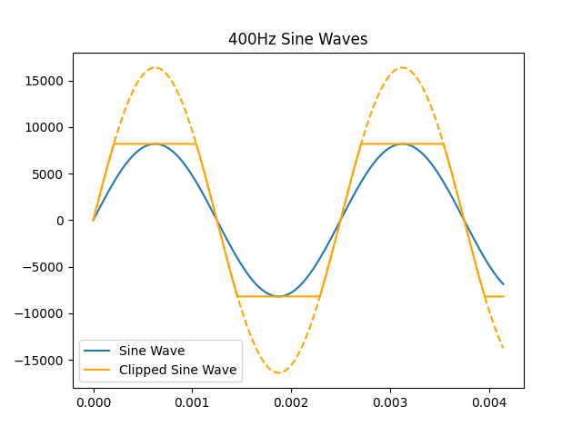
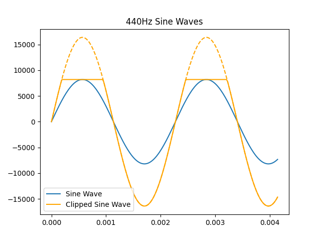

# assignment1

Briefly, I used `scipy.io.wavfile` to read/write a normal and a clipped sin wave to .wav files. I used `sounddevice` to output this audio directly to my computer's speakers. An example of reading files and playing that output can be found in `play_the_noises.py`, though I play the numpy arrays directly (do not read from file) in `clipped.py`. As the directions specify, I used the parameters ... 
- amplitude = 8192 (half the range of a signed 16-bit integer)
- frequency = 440 Hz (A4)
- sample_rate = 48000

I generated a range using `np.linspace` (the input-values for our sine function). Then I used the formula 
$y = amplitude * np.sin(2*\pi*frequency*x)$ to generate the sin wave. 

To create the clipped sine wave, I multiplied the initial sine wave by 2 (to get from $\frac{1}{4}$ to $\frac{1}{2}$ of the max value) and then set all values outside of the range [-8192, 8192] to $\pm$ 8192. 

Below is a sample of the first ~4 ms of each sine wave. To better visualize the clipped wave, I also overlay a dotted line in the same color to show the wave's values if it _were not clipped._

As expected, the clipped wave _feels louder_, though its max amplitude is technically the same as the smooth sine wave. I also felt the sound in different parts of my head, almost like I would make different shapes to reproduce the sound with my voice. 

## Volume
I found that the raw audio was _extremely loud_, in my opinion. To combat this, I lowered the amplitude by dividing both `y` arrays by 10,000. I also found that when I played the .wav files using Quicktime, my computer's volume control were over-written. Because I cannot control these in code (unless I save lower amplitude files instead of following directions), I chose not to play these files using Quicktime and only in-code using `sounddevice`. 

## Running the code
Code which saves the requested information to `sine.wav` and `clipped.wav` as well as playing the sine and clipped-sine waves using `python clipped.py`. 

## Playing audio files
My assignment includes three audio files:
1. The requested `sine.wav` file including a $\frac{1}{4}$max-amplitude sine wav at 440Hz
2. The requested `clipped.wav` file including a $\frac{1}{2}$max-amplitude sine wav at 440Hz clipped to $\frac{1}{4}$max-amplitude.
3. Bonus: a $\frac{1}{2}$max-amplitude sine wav clipped on one side, saved to `asymm_clipped.wav`

They can all be played, in the order listed above, by running `python play_the_noises.py`. 

## Further experiments

Because I clip the positive and negative sides of the sine wave seperately, I also decided to see what it would sound like if only one side of the wave were clipped:

Choosing to clip positive vs. negative values sound identical to me. I was suprised to find that they do sound _different_ than clipping both sides! In my opinion, it sounds more 'nasally' than symmetrically clipping pos/negative values. In other words, it felt as though the asymmetrically-clipped wave is most similar to making a nasaly 'eee' sound, the clipped wave is most similar to a nasally 'ehhh' sound, and the smooth sine wave is most similar to a properly/cleanly voiced vowal sound. 

The asymmetrically clipped values are saved in `asymm_clipped.wav`